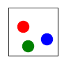

# An Implementation of GraphNets, applied to Simulated Billiards data

 

(Left) Real Data. (Right) Rollout generated from model trained for 100k iterations. While physically plausible, note that there is some drift. [Interaction Networks](https://arxiv.org/pdf/1612.00222.pdf) reports training for 2000 epochs, which equates to about 20 million iterations.

This codebase provides an implementation of [GraphNets](https://arxiv.org/abs/1806.01261) to a simple Billiards example. This codebases uses [PyTorch Geometric](https://pytorch-geometric.readthedocs.io/en/latest/) to implement the GNNs.

## Code structure:

* [create\_billiards\_data.py](create_billiards_data.py) Code for creating Billiards data. Run `python create_billiards_data.py -h` to see options. 
* [visualize\_billiards.py](visualize_billiards.py) Code for visualizing the Billiards data (see GIFs above).
* [data_loader.py](data_loader.py) A PyTorch dataloader. Note that graph construction ([torch_geometric.Data instances](https://pytorch-geometric.readthedocs.io/en/latest/notes/introduction.html#data-handling-of-graphs)) is done OUTSIDE of the data loader, which probably isn't normal.
* [graph_construction.py](graph_construction.py) Contains a method that takes in node states, and then computes the graph. It assumes a batch, and spits out a [batch graph](https://pytorch-geometric.readthedocs.io/en/latest/notes/introduction.html#mini-batches). 
* [losses.py](losses.py) Code for loss function. We use normalized MSE loss, which divides MSE by stddev because states are in range [0,10], while velocities are roughly in range [-.25, .25]. normalized MSE loss weights them similarly.
* [networks.py](networks.py) Code for GraphNet layers (see [here](https://pytorch-geometric.readthedocs.io/en/latest/_modules/torch_geometric/nn/meta.html#MetaLayer)), and inference.
* [train.py](train.py) Code for training the GraphNet. 
* [billiards.ipynb](billiards.ipynb) Jupyter Notebook for network/training configurations, and for training the network. Make sure to change the `... # TODO` strings to point to the appropriate directories.

## Dependencies
* Python 3.x
* PyTorch (tested on 1.4.0)
* PyTorch Geometric (tested on 1.4.1)
* TensorBoard
* matplotlib

## Other notes:
* States are: `[x, y, dx, dy]`, i.e. position/velocity
* Edges are: `[x_d, y_d] - [x_s, y_s]`, where `d` means destination (node edge points to) and `s` means source (node that edge points from). These are directed edges, but we compute a fully-connected graph.
* Loss function is a multi-step loss function. See `losses.py` and `train.py` for more details.
* GraphNet structure: 2 GraphNet layers total. See [networks.py](networks.py) for more details.

## Acknowledgements
* Some code adapted from `https://github.com/stelzner/Visual-Interaction-Networks/`
